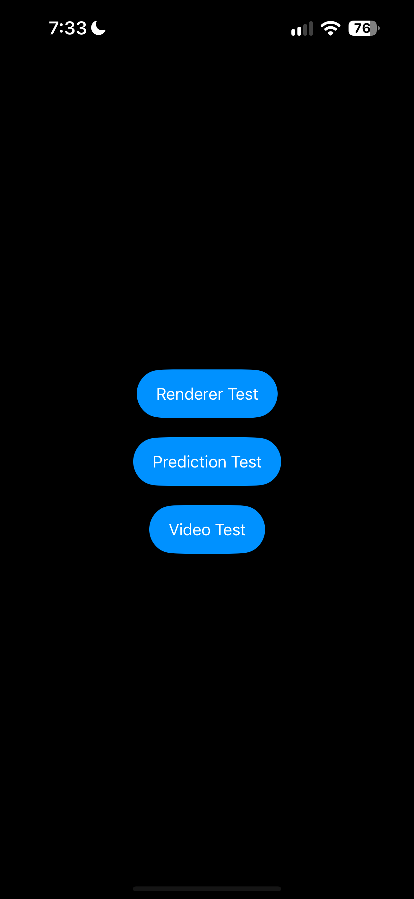
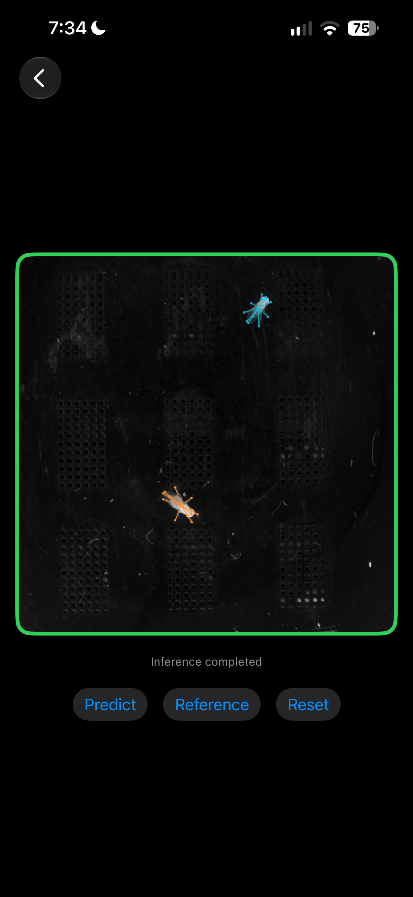
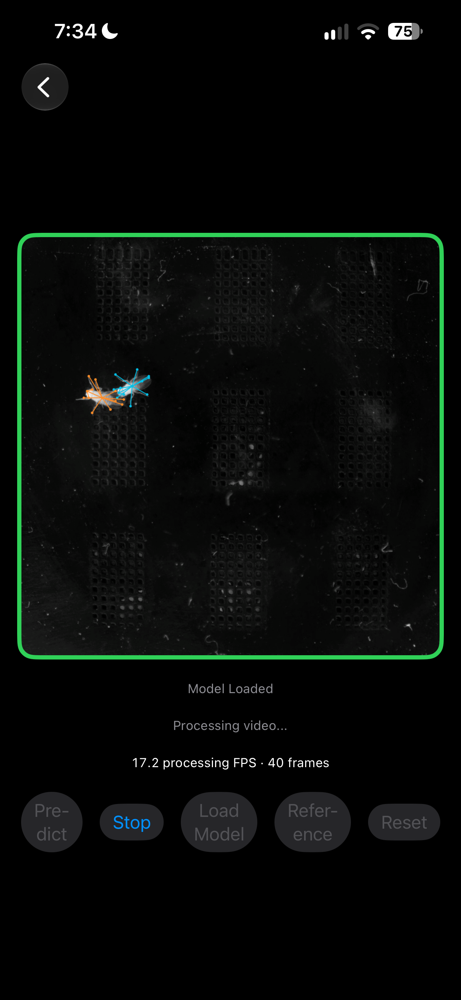

# SLEAP iOS

**Animal pose estimation on iPhone and iPad, powered by SLEAP-trained models.**

A SwiftUI prototype that runs a trained fly pose model locally using ONNX Runtime with Core ML acceleration. It predicts body-part locations in images and video, draws skeleton overlays, and displays processing FPS.

## Demo


**[Try it on TestFlight](https://testflight.apple.com/join/tQRBwW7R)**  

## What it does

- **Renderer Test:** Draw saved predictions over a reference image and compare with the Python reference overlay.
- **Prediction Test:** Run the model on the reference image and render the results.
- **Video Test:** Process the bundled video frame by frame, with overlays, processing FPS, and stop/reset controls.
- **On-device inference:** Use ONNX Runtime's Core ML execution provider without a server.


<table align="center"> 
  <tr> 
    <td align="center"><br><sub>Renderer Test</sub></td> 
    <td align="center"><br><sub>Prediction Test</sub></td> 
    <td align="center"><br><sub>Video Test</sub></td> 
  </tr> 
</table>

## Run it

Requires **Xcode 26** and **iOS/iPadOS 26.0**, matching the current project configuration.

1. Open `SLEAP iOS.xcodeproj`.
2. Let Swift Package Manager resolve the ONNX Runtime dependency.
3. Select your development team under **Signing & Capabilities**.
4. Choose a simulator or connected device, then build and run.

The trained model and sample media are included.

For video inference, open **Video Test**, select **Load Model**, then **Predict**.

## How it works

```text
Image or video frame
    → Grayscale preprocessing
    → ONNX inference with Core ML acceleration
    → Decode body-part coordinates
    → Draw skeleton overlay
    → Display in SwiftUI
```

The bundled SLEAP-NN model uses two stages: locate each fly, then predict its body parts from a crop. It accepts a **1024 × 1024 grayscale frame** and predicts **13 keypoints per fly**, with up to **two flies per frame**.

Preprocessing, inference, and rendering are separate components. An actor-based `PoseEstimator` protocol provides a common interface for potential future inference backends.

**Stack:** SwiftUI · AVFoundation · Core Graphics · ONNX Runtime 1.24.2 · Core ML

## Performance


| Device | Processing FPS |
| --- | --- |
| iPhone 15 Pro Max | 17 |
| iPad Pro 11-inch, M1 | 14 |

The counter includes frame conversion, preprocessing, inference, decoding, and rendering. It measures processing throughput, not the video's source frame rate or screen refresh rate.

Record results using the same clip and a Release build on each device; include the OS version and sustained performance after warm-up.

## Current scope

- Supports the bundled fly model and sample media.
- Predictions are independent across frames. **Persistent identity tracking is not implemented**, so animal colors can swap.
- Live camera inference, importing media, and exporting annotated videos are future work.
- Core ML acceleration is provided through ONNX Runtime; there is no standalone Core ML or custom Metal backend yet.

## Credits

Built on the [SLEAP](https://github.com/talmolab/sleap) ecosystem from Talmo Lab: [SLEAP-NN](https://github.com/talmolab/sleap-nn) for training/export and [SLEAP-IO](https://github.com/talmolab/sleap-io) for Python reference visualization. Inference uses [ONNX Runtime](https://github.com/microsoft/onnxruntime).

## Check out my other work
[Portfolio](https://portfolio.sladdagiri.org)
